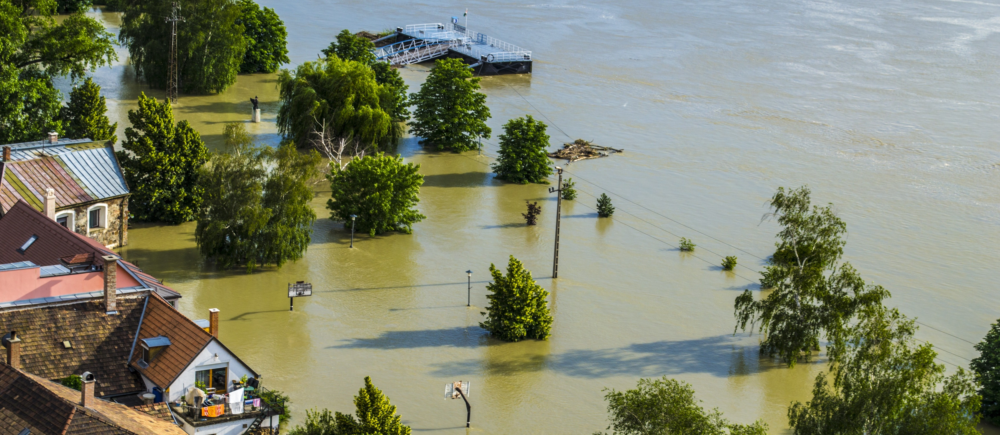
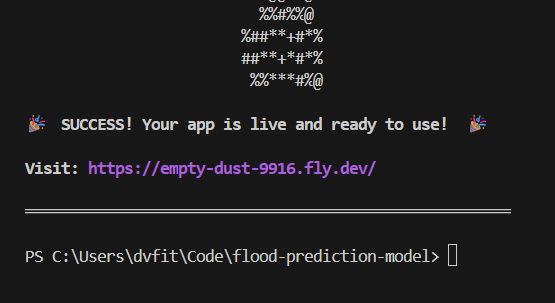
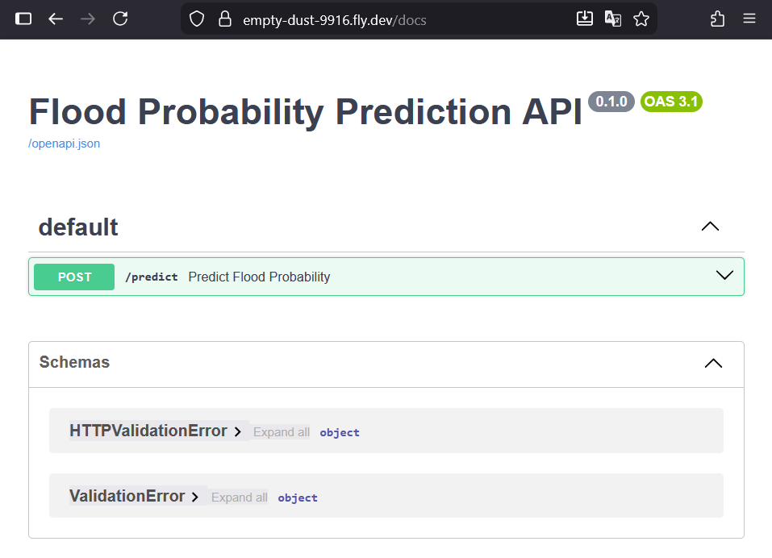
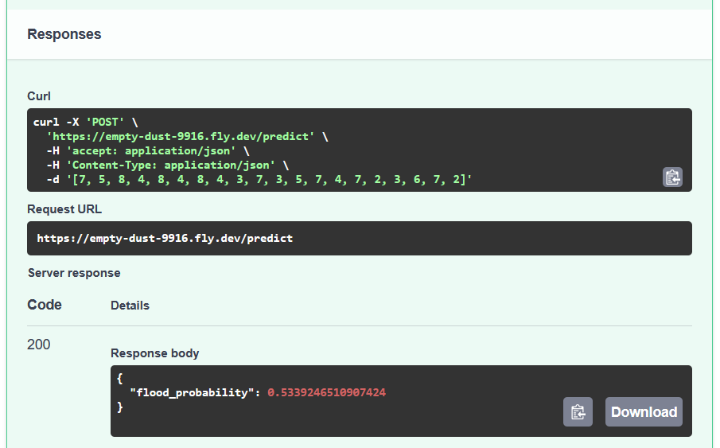
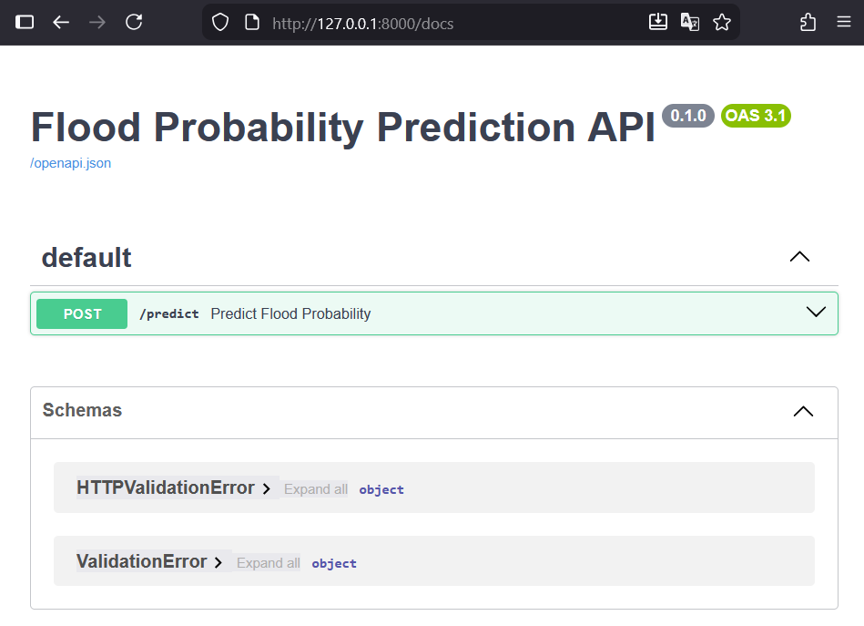
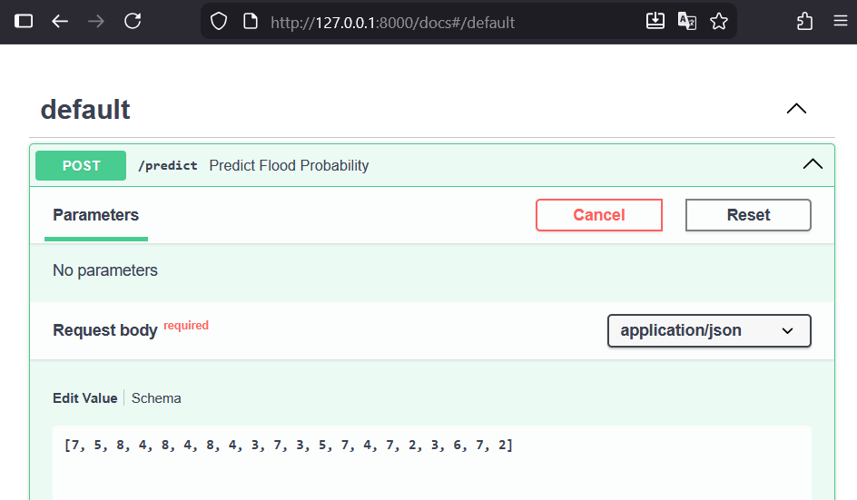
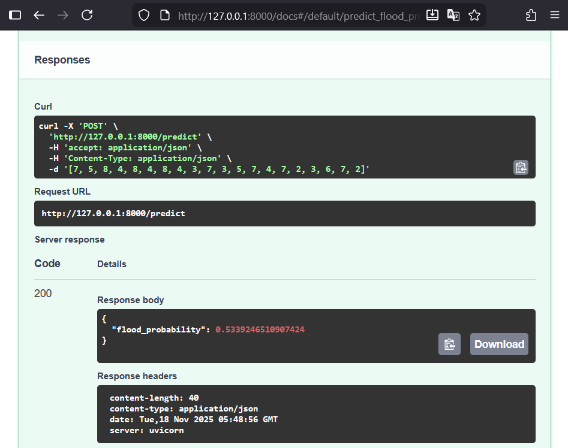

# Flood Prediction Model
## Purpose
This project was created to be submitted as Midterm Project for the [Machine Learning Zoomcamp](https://github.com/DataTalksClub/machine-learning-zoomcamp) (2025 cohort).

## Problem Description
As reported by the [World Meteorological Organization](https://wmo.int/topics/floods), floods are the deadliest type of natural disaster. Furthermore, the damages caused by flooding have been growing over time in the last decades due to an "increasing frequency of heavy precipitation, changes in upstream land-use and a continuously increasing concentration of population and assets in flood-prone areas" (WMO, n.d.).

Being able to estimate the probability of flooding of an area is a crucial tool for flood planning and management, as it might help identify measures that could reduce the risk of damages. 

## Project Goal
The goal of this project is to estimate the probability of flooding of an area based on various factors. This is achieved by testing different machine learning models on the data available, and selecting the best-performing one. The selected model is deployed as a service in a Docker container.

## Data
The dataset used for this project is fictitious. It was generated for a competition hosted on [kaggle](https://www.kaggle.com/competitions/playground-series-s4e5/data). To facilitate reproducibility, the dataset has been included in the files of this project. The dataset is contained in the ```train.csv``` file.

This dataset contains an id column, 20 features representing different variables that can potentially influence flooding, and the flood probability, which is the target varaiable. As described in the EDA section of the jupyter notebook ```notebook.ipynb```, all features are of type ```int``` and the target variable is of type ```float```. For details regarding the distributions of the variables and their correlation, refer to the EDA section in the notebook.

## Model Training
4 types of regression models were tested for this project:
1. LinearRegression
2. Ridge
3. DecisionTreeRegressor
4. XGBoost
The performance of the models was assessed using the root mean square error (RMSE).

As explained in the notebook, based on the different parameter values tested with the different models, the lowest RMSE value was obtained with the LinearRegression model. The LinearRegression model was therefore trained using the full training dataset and used for creating the final model.

## App Containerization and Deployment
The training of the final model is performed in the ```train.py``` script, which saves the model in a bin file.

The ```predict.py``` script contains the app that serves predictions of the flood probability based on the provided input values.

A Dockerfile has been created and can be used to build and run the predict app within a container.

The app was temporarily deployed on Fly.io and tested, as shown in the screenshots below. 







To avoid any unnecessary costs, the app was destroyed.


## How to Reproduce

### Option 1: download the image from Docker Hub (subject to time limit)
The image has been made available on Docker Hub for a limited time (it might no longer be available). To be able to use it, you need to have Docker installed on the machine you want to run the image on, and you need an account that allows you to access Docker Hub.

1. First check if the image is still available:
```
docker manifest inspect davidvfitzgerald/flood-prediction-model:prod
```

If information is returned, this means the image is still online and can be used. If the message "no such manifest" is returned, then the image is no longer online and you will need to use the other option below to run the app.

2. If the image is available, run the following commands to download the image and run it:
```
docker pull davidvfitzgerald/flood-prediction-model:prod
```
```
docker run -p 8000:8000 davidvfitzgerald/flood-prediction-model:prod
```

3. To test the app, open the URL and go to the docs as shown below.


4. Click on the predict app and try it outby providing the following list as input value:

```
[7, 5, 8, 4, 8, 4, 8, 4, 3, 7, 3, 5, 7, 4, 7, 2, 3, 6, 7, 2]
```


5. You should get the following response:



### Option 2: clone the repository

Follow the steps described below in case the container image cannot be pulled from Docker Hub.


## References
World Meteorological Organization. (n.d.). Floods. Retrieved November 16, 2025, from https://wmo.int/topics/floods

